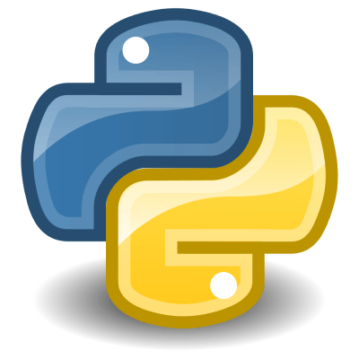

# Mastering Python
This is a personal repository that contains notes and codes samples taken in online courses about Python Programming Language. All these courses are, in a common way, similar. So I decided to push all my codes and notes in this single repository. 

## About Python Programming Languages

Python is a high-level, interpreted, general-purpose programming language. Its design philosophy emphasizes code readability with the use of significant indentation.

Python is dynamically-typed and garbage-collected. It supports multiple programming paradigms, including structured (particularly procedural), object-oriented and functional programming. It is often described as a "batteries included" language due to its comprehensive standard library.

Guido van Rossum began working on Python in the late 1980s as a successor to the ABC programming language and first released it in 1991 as Python 0.9.0. Python 2.0 was released in 2000 and introduced new features such as list comprehensions, cycle-detecting garbage collection, reference counting, and Unicode support. Python 3.0, released in 2008, was a major revision that is not completely backward-compatible with earlier versions. Python 2 was discontinued with version 2.7.18 in 2020.

Python consistently ranks as one of the most popular programming languages.

## The Courses
- [The Python Programming A-Z Definitive Diploma in 2022](https://www.udemy.com/course/the-ultimate-python-programming-a-z-masterclass)
- [Automate the Boring Stuff with Python Programming](https://www.udemy.com/course/automate/)
- [The Complete Python 3 Course: Go from Beginner to Advanced!](https://www.udemy.com/course/learn-python-3-from-beginner-to-advanced)
- [The Python Developer Essentials 2022 Immersive Bootcamp](https://www.udemy.com/course/new-python-programming-the-complete-guide-2021-edition)
- [The Python Programming Comprehensive Bootcamp](https://www.udemy.com/course/the-python-programming-v39-comprehensive-bootcamp)

## References
- https://en.wikipedia.org/wiki/Python_(programming_language)

## License
Apache License 2.0
